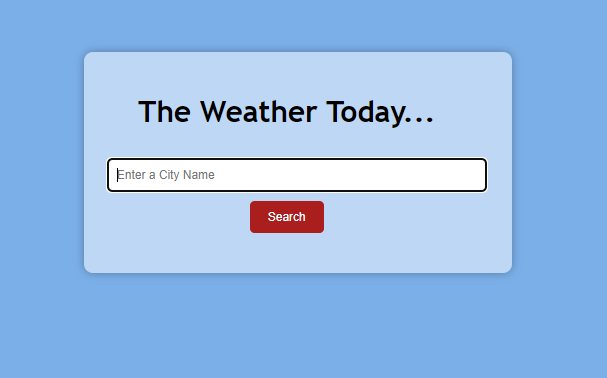
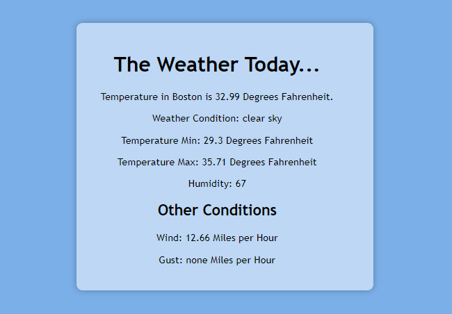
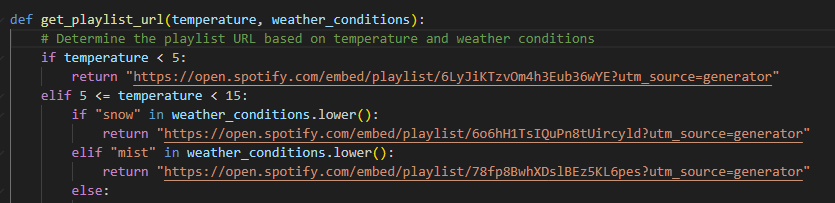
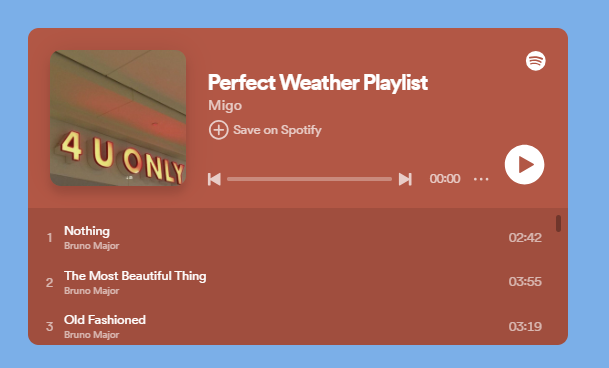
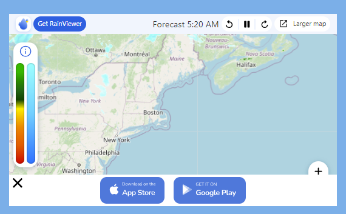
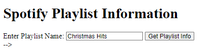
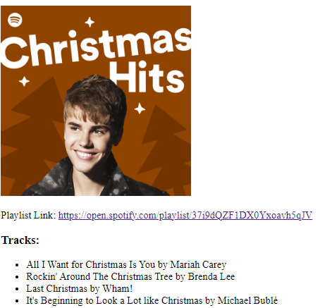
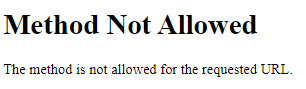
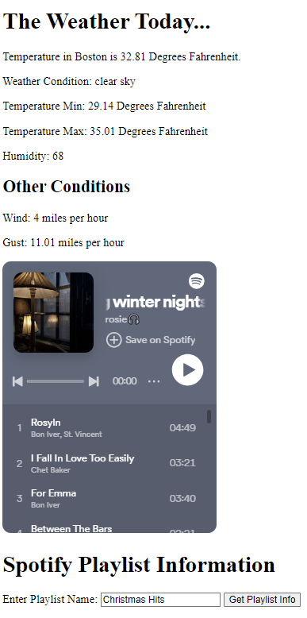
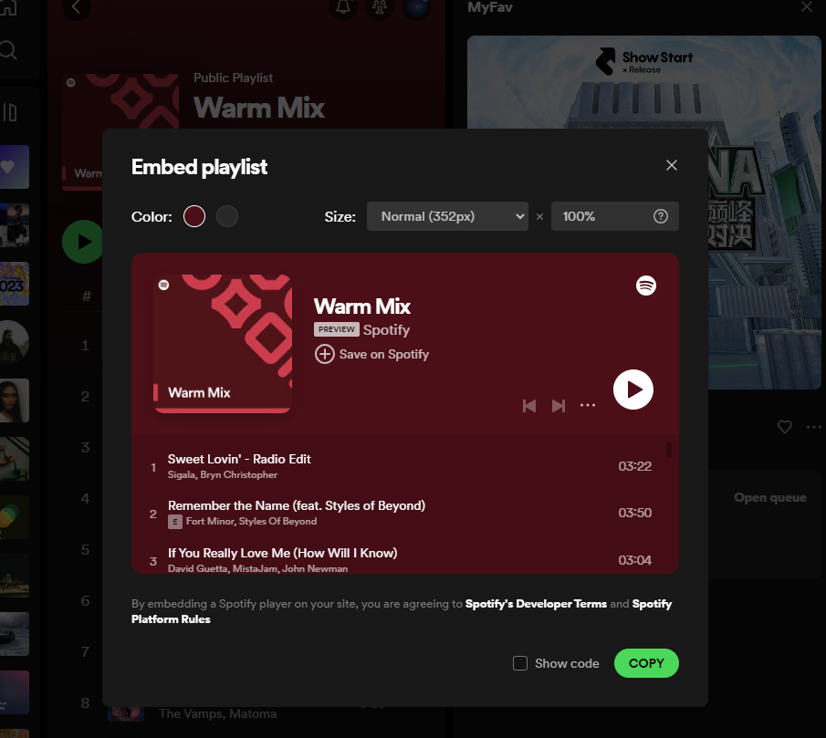

# **Welcome to the Weather Plus Spotify Music Player**: :sun_behind_small_cloud:
- This web app is designed to find the weather of a major city and return a playlist based on the weather conditions such as temperature. 
- This is a simple app, the orginal idea was also to utilize the Spotify API, yet there were some issues running the output with allowing the user to search/ be recommended a playlist. 
- The Spotify.py file is an example of running the API and breaking down the JSON responce data. 
- Future plan of adding Spotify Capabilities 

# **How to use the app?** :compass:

Download the required packages before running the code:

- Flask (pip install Flask)
- JSON (pip install json)
- Base64 (pip install pybase24)
- Dotenv (pip install python-dotenv)

# **Required Access for APIs**:world_map:

The following API keys are required to run this app: 

- OpenWeather API (https://openweathermap.org/appid)
- Spoify API (https://developer.spotify.com/documentation/web-api/tutorials/getting-started)

 
# **How Does it Work**  :cowboy_hat_face:

- This app utilizes the OpenWeather API which returns JSON data. 
- The user will input a desired city "location" and the app will access the API and searched for the desired location and return the JSON data, which will be further split into the desired data points of temperature, feels like temperature, temp. min, temp. max, humidity, wind, and gust speeds. where the response data is broken down based on the location 
- 
- Once the data has been gathered by the app it will be loaded onto the weather.html page
- The weather.html page has a textbox where all of the data points will be imputed 

- The data points from the API for the specific location will be utilized by the get_playlist_url function to choose from a few pre-selected weather/ temperature themed playlists. 
- The determination of the playlist is based on temperature range and weather conditions
- The get_playlist_url function utilizes a basic if else statement to return a url to the corresponding Spotify playlist

- This corresponding Spotify playlist will then be inputed into the weather.html page, where it will be showcased in a mini Spotify Web Player via embeded code from Spotify 

- The weather.html page additionally has a live weather map that was added from the RainViewer (https://www.rainviewer.com/radars/united-states.html) via embeded code

# **Design Choices/ Issues** :orange:

- Orginally the plan was to utilize the Spotify API yet it proved to be a bit more difficult when implementing into Flask, even though it utilizes JSON data format.
- In the spotify.py file is an area showing the ability to read JSON data from the API and return either with an artist or the song titles listed in a playlist.

- One of the common issues with adding the Spotify API aspect was the connecting multiple pages and ending up with a 404 error

- Sometimes I would be able to obtain the music playlist I searched for and be missing the linking to the OpenWeather Data for my desired location

- After searching a bit, I found that Spotify had the ability to embed a playlist straight into HTML thorugh a mini web player. 
- The embeded playlist seemed like the most effective way forward since it would require less work with the CSS styling
 
- One drawback of the embeded playlist is the limit on the various playlist that could be possible for the weather combinations. Since all of the possible playable playlists right now in the website are pre-selected. 